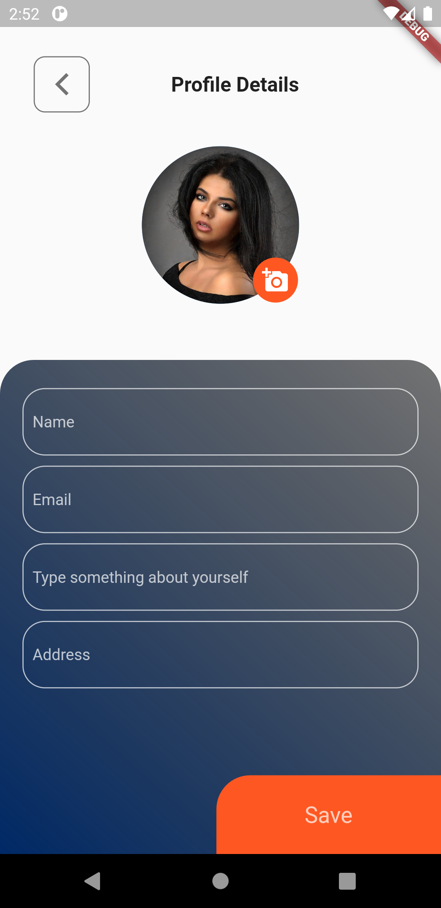

# Profile details UI | Flutter UI tutorial

Design profile details UI in the flutter.

## Getting Started
[Click here for complete tutorial](https://www.warmodroid.xyz/tutorial/flutter/learn-how-to-design-profile-details-ui-in-the-flutter/)
